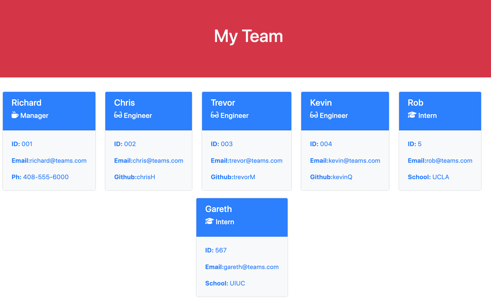

# Team-Profile-Generator


## Table Of Contents
* [Description](#description)
* [Video of the Team Profile page generation](#video-of-the-readmemd-file-generation)
* [Screenshots](#screenshots)
* [Installation](#installation)
* [Usage](#usage)
* [Tests](#tests)
* [Code Snippets](#code-snippets)
* [License](#license)
* [Author Links](#author-links)
## Description
This program generates a HTML page after taking in user input. The program uses the inquirer.js module to prompt the user for details about employees in a team. Each employee can be either a manager, an engineer or an intern. This information is used to generate the HTML page displaying each team member.  

## Video of the Team Profile generation
The Team Profile Generator receives user input and generates the index.html in the *dist* folder. The *dist* folder with a sample index.html that was generated is included in the repo.

WEBM format: <https://drive.google.com/file/d/1cGtIlGMjNcU5RLvsjTQZOxJq8DjMap9O/view>

MP4 format: <https://drive.google.com/file/d/14jaqLyH3nknASmX5LbuOhg4I8P5uSNap/view?usp=sharing>

## Screenshots
### The generated HTML




## Installation
This requires the installation of inquirer.js and the fs (native) module. Please do the following in your bash:

```bash 
$ npm init -y
$ npm install inquirer@6.3.1
$ npm install jest
```

## Usage
To run this generator, please do the following. 

```bash
$ node index.js
```
Answer the prompt questions and proceed to generate the html file - index.html The file is generated in the *dist* folder. The folder also contains the CSS stylesheet.


## Tests
#### 1. Check if the index.html file is generated under the *dist* directory.
#### 2. Run tests with jest for each class - Employee, Manager, Engineer and Intern
```
$ npm run test
```

## Code Snippets
#### 1. Classes - Employee base class; Manager, Engineer and Intern inherit from Employee.

#### Engineer class
```
class Engineer extends Employee {
  constructor(name, id, email, githubUsername) {
    super(name, id, email);  // calling on Employee's constructor
    this.githubUsername = githubUsername;
  }
  getGithub = () => this.githubUsername;
  getRole = () => "Engineer";
}
     
```
#### Questions for the Manager profile. 
```
let managerQs = [
  ...employeeQs,  // has questions for name, id and email
  {
    type: 'input',
    message: "Please enter the office number:",
    name: 'officeNumber'
  }  
];

```

#### inquirer prompt, receive response
```
function addManager() {
  inquirer.prompt(managerQs)
  .then(data => {
    var manager = new Manager(data.name, data.id, data.email, data.officeNumber);
    team.push(manager);
    addEmployee(); // add other employees
  });
}
```

#### 2. Generate the HTML - this code checks the employee's role and displays the role along with a specific icon. The ```specificMarkup``` gets properties that are specific to that role (office number, github link, or school name). 
```
switch (member.getRole()) {
    case "Manager": specificMarkup += `<p class="card-text"><b>Ph:</b> ${member.getNumber()}</p>`;
                    specificIcon = `<i class="fa-solid fa-mug-hot"></i>`;
                    break;
...

```

## License
This application is covered under the [MIT License](https://opensource.org/licenses/MIT).

## Author Links
[GitHub](https://github.com/sbhikshe)\
[LinkedIn](https://www.linkedin.com/in/sripriya-bhikshesvaran-8520992/)
